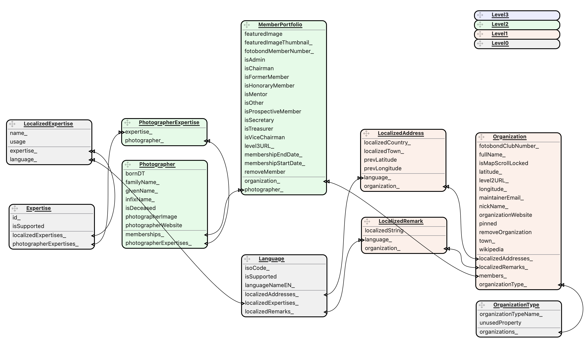

# Photo Club Hub Data

Swift package with the Core Data model, JSON loaders and value types shared by the Photo Club Hub apps.

Two apps currently depend on this package (the list may grow):

- **[Photo Club Hub](https://github.com/vdhamer/Photo-Club-Hub)** — the iOS app for viewing photo club member portfolios.
- **[Photo Club Hub HTML](https://github.com/vdhamer/Photo-Club-Hub-HTML)** — a macOS app that generates a static website from the same data.

Keeping the data layer in one place removes the roughly 60 files that previously had to be manually kept in sync between these two repositories.

## Requirements

| | |
|---|---|
| Swift tools | 6.1 |
| Platforms | iOS 17+, macOS 14+ |
| Xcode | required, also for command-line builds — see [Core Data model](#core-data-model) |

## Adding the dependency

```swift
.package(url: "https://github.com/vdhamer/Photo-Club-Hub-Data", .upToNextMajor(from: "3.0.0"))
```

The repository name and the package name differ (hyphens versus spaces), so consumers need the two-argument product form:

```swift
.product(name: "Photo Club Hub Data", package: "Photo-Club-Hub-Data")
```

In Swift source files the module is imported using:

```swift
import Photo_Club_Hub_Data
```

## Versioning

This package uses plain [semantic versioning](https://semver.org): **MAJOR** on a change that breaks
consumers, **MINOR** on additive public API, **PATCH** on fixes. Pin it the ordinary way —
`.upToNextMajor(from: "3.0.0")`, which is also what Xcode generates by default — and a breaking
release can never arrive unasked.

- Very briefly - up to 2.11.x - the three Photo Club Hub repositories shared a version prefix as a "release train",
  with the compatibility boundary at the second position rather than the first. That made the
  conventional `.upToNextMajor` pin unsafe for anyone unaware of the local rules, so it was dropped:
  all three were aligned at **3.0.0** once and their versions float independently from then on. The
  two apps' versions are labels for their users and say nothing about this package.
- `PhotoClubHubDataVersion.semver` carries the version programmatically, because SwiftPM code cannot read its own git tag and `Bundle.module` carries no version. The release checklist asserts that this constant matches the tag being pushed; both apps display it, so a stale value misreports which library a binary was built against.
- **No build number.** This package produces no artifact to number. A candidate handed to another
  developer is identified by its commit, which their own `Package.resolved` records automatically —
  version *and* revision. See issue #17.

## The three-level JSON data

Data is loaded from JSON files in three sequential levels. A club can be at any level, and levels are additive.

| Level | Content | Loader |
|---|---|---|
| **0** | Reference data: supported expertises, supported languages, and expertise translations | `Level0JsonReader` |
| **1** | Organizations — photo clubs and museums — with town and coordinates | `Level1JsonReader` |
| **2** | Members per club, with roles, status and portfolio links | `Level2JsonReader` |
| **3** | Image portfolios per member | fetched by the apps, not by this package |

**Level 0 must complete and save before Level 2 starts.** `Expertise` has a uniqueness constraint on `id_`; Level 0 creates expertises with `isSupported=true`, while Level 2's `findCreateUpdateUndefSupported()` creates them with the default `isSupported=false`. Whichever context saves last wins per property, so concurrent saves corrupt the flag. Level 1 and Level 2 may run concurrently with each other.

The sequencing is this package's responsibility, not the consuming app's: `LevelLoader.loadAllLevels(usedContainer:)` runs one complete pass — Level 0 awaited to completion, then Level 1, then every Level 2 club loader concurrently — and returns only after the last loader has finished. An app supplies only the container to load into; the background contexts' merge policy is set here rather than by the app, because the apps used to disagree about it and this invariant depends on the sequencing rather than on the policy (see `MergePolicyTest` for characterizing the behavioral options, and `LevelLoaderTest` for the ordering assertion).

For the semantics of individual entities and the JSON file formats, the [Photo Club Hub README](https://github.com/vdhamer/Photo-Club-Hub/blob/main/.github/README.md) is the detailed reference — it is written for club administrators maintaining the data, and is not duplicated here.

## Core Data model

The model lives at `Sources/Photo Club Hub Data/Model/Photo_Club_Hub.xcdatamodeld` and has 14 entities across 34 versioned schema revisions. The container name is `"Photo_Club_Hub"` and must stay that way: existing iOS installations upgrade their store in place.

Two things about this model are unusual, and both exist so that the package builds without Xcode's build system:

### The generated NSManagedObject classes are committed

All 14 entities are set to Codegen **Manual/None**, and the 21 files Xcode would otherwise generate live in `Sources/Photo Club Hub Data/ViewModel/CoreDataGenerated/`. A standalone package has no Xcode codegen for bare clones or CI, so these files are the only source of truth.

**Maintenance rule:** any schema change — adding or removing an attribute or relationship — requires hand-updating the matching `+CoreDataProperties.swift`. The `+CoreDataClass.swift` files are static (`class Foo: NSManagedObject {}`) and never need touching.

### A build plugin compiles the model

`swift build` has no rule for `.xcdatamodeld`: it reports the model as an unhandled file, no `.momd` reaches the resource bundle, and `PersistenceController` then trips a `fatalError` looking for it. `Plugins/CompileCoreDataModel` closes that gap by running `momc`, which is why **Xcode must be installed even for command-line builds** — `momc` ships inside Xcode, not in the Swift toolchain nor in the separate "Command Line Tools for Xcode" package.

The model is deliberately listed in the target's `exclude:` in `Package.swift`. Without that, Xcode applies its own built-in `.xcdatamodeld` rule *in addition to* the plugin and the build fails with `Multiple commands produce … Photo_Club_Hub.momd`. That exclusion is load-bearing — do not remove it.

Because the package's plugins arrive from a remote dependency, consumers may encounter Xcode's plugin-trust prompt on first resolution, and `xcodebuild` in CI may need `-skipPackagePluginValidation`. Trust is granted per package, not per plugin, so the second plugin ([linting](#linting)) adds no further prompt.

## The data-model diagrams

The entity diagrams in the Photo Club Hub README are **not** produced by Xcode. They come from the third-party [Core Data Model Editor](https://github.com/Mini-Stef/Core-Data-Model-Editor) app, which opens the `.xcdatamodeld` and exports the diagram image. Regenerate by opening the model in that app, adjusting if needed, and exporting.



Two consequences worth knowing before touching anything in the model directory:

1. **`Level0`, `Level1`, `Level2` and `Level3` are placeholder entities. Do not delete them.** They only exist so the diagrams can show a legend that maps levels to their colors in the diagram.
2. **`EntityPositions.json`, `ConfigurationColors.json` and `EntityColors.json` are that app's saved state** — 70 files, tracked in git so the layout and layer coloring persists and can be shared across machines.`

## Developing app and package together

While co-developing an app and this package, use a **local package override** rather than retagging: add a local checkout of this repository to the app's Xcode workspace (File ▸ Add Files, or drag the folder in), and Xcode shadows the remote dependency with your working copy. Remove it from the workspace to go back to the resolved remote version.

This also restores the package's tests inside Xcode. Xcode surfaces test targets for local packages but **not** for remote package dependencies, so without an override the tests below only run from the command line.

## Linting

SwiftLint runs on **every build**. The two apps get that from an Xcode "Run SwiftLint" build phase; a package has no `.xcodeproj` to hang a phase on, so `Plugins/RunSwiftLint` does the same job as a build tool plugin.

It shells out to whichever `swiftlint` is on `PATH`, falling back to the usual Homebrew locations, rather than depending on a SwiftLint package. That keeps SwiftLint out of both apps' dependency graphs, and keeps the build and the command line on one version. SwiftLint ships with neither Xcode nor the Swift toolchain, so it has to be installed:

```sh
brew install swiftlint
```

A missing `swiftlint` is a warning rather than a build failure, so a bare clone and CI still build. Violations are likewise warnings and do not fail the build, matching the apps' behaviour. `.swiftlint.yml` relaxes no rules — it only excludes `.build` and the committed Core Data codegen (see [above](#the-generated-nsmanagedobject-classes-are-committed)).

Two consequences worth knowing:

- The plugin is attached to the library target, so **both apps lint this package whenever they build it**, and the violations appear in the app's build log against this package's file paths.
- Linting re-runs only when a Swift file in the package has changed, unlike the apps' phase, which is marked always-out-of-date.

## Testing

```sh
swift test
```

97 tests in 22 suites, with an in-memory Core Data store per suite.

### Tests run against frozen data

Every test reads its JSON from a **frozen copy inside the package** (`Tests/Photo Club Hub DataTests/JSON/`), never from the network. Those copies are deliberately allowed to drift from the production files they were taken from — a fixture may be a year old, and that is the point: a test asserts against data it owns, so editing production data cannot turn this suite red.

In production the readers fetch from `https://raw.githubusercontent.com/vdhamer/Photo-Club-Hub/main/JSON/` and fall back to `Bundle.module`. `useOnlyInBundleFile: true` bypasses the remote read, and every reader call site in the tests passes it, so **a `swift test` run makes no HTTP requests at all**.

To re-verify that claim after changing reader code, temporarily point `dataSourcePath` in `FetchAndProcessFile.swift` at an unresolvable host and run the suite: every attempted fetch then prints "Could not access online file", so zero such lines means zero attempts. Counting those lines against the real URL proves nothing — a *successful* fetch prints nothing at all.

Two guardrails keep it that way:

1. **`useOnlyInBundleFile` has no default value.** Every call site must state its intent, so a new test that simply forgets the argument is a compile error rather than a silent live read.
2. **Fixtures carry a `Test` suffix where the name is free** — `rootTest.level0.json`, `museumsTest.level1.json`. The fixture name is what composes the remote URL, so a suffix production never uses guarantees a 404 and therefore the bundle copy, even if guardrail 1 is somehow bypassed.

Four Level 2 fixtures cannot take the suffix: `TemplateMin`, `TemplateMax`, `fgDeGender` and `fgWaalre` are loaded through their `*MembersProvider`, which composes the filename from the club's nickname. Their names do exist in production and do resolve, so those four rely on guardrail 1 alone. Keep that in mind when touching provider tests.

Two known issues:

- **Run tests serially if you see the suite abort rather than fail.** A process-global test spy can be deinstalled by a concurrently running suite, turning a deliberate `ifDebugFatalError` into a real crash that takes down all 97 tests. Use `swift test --no-parallel` until [#1](https://github.com/vdhamer/Photo-Club-Hub-Data/issues/1) is fixed.
- **`.xcstrings` is not compiled by `swift build`.** `PhotoClubHubData.xcstrings` lands in the bundle raw, so localized lookups fall back to raw keys on the command line even though they work in Xcode. No current test depends on localized output — but a localization assertion would pass in Xcode and fail in CI, so avoid writing one.

## License

MIT — see [LICENSE.md](LICENSE.md).
